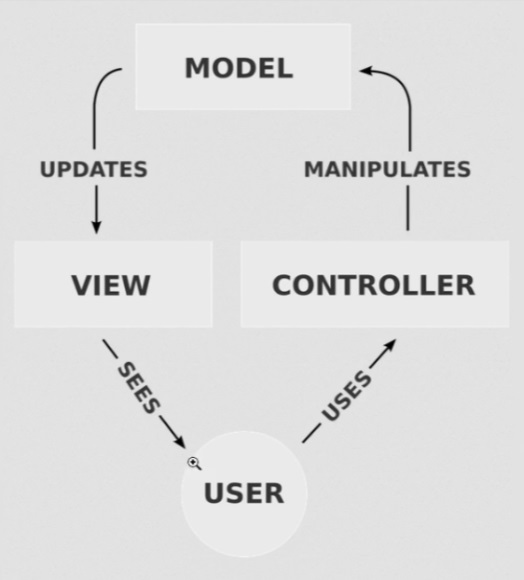

# Flask framework
## CRUD (Create, Read, Update and Delete)

**O objetivo desse projeto é praticar o desenvolvimento de API's usando o Python com o framework Flask, bem como as ferramentas complementares para desenvolvimento do projeto.**
O projeto simula uma rede social, utilizando as tecnologias HTML, CSS e JS (+bootstrap) em seu frontend e Python (+Flask) em seu backend, também foi utilizado SQLite como banco de dados. Além disso, também foram realizados testes unitários utilizando ``pytest`` para testar as funcionalidades da aplicação.

## Principais funcionalidades

- Cadastro de novos usuários (Create)
- Visualização de usuários cadastrados (Read)
- Edição de dados dos usuários (Update)
- Exclusão de um usuário da base de dados (Delete)
- Controle de acessos (Gerenciamento de login)

## Pré-requisitos

Antes de iniciar o projeto, certifique-se de ter instalado em seu ambiente de desenvolvimento:

- Python 3 ou superior (versão do projeto: ``3.9.13``)
- Flask (versão do projeto: ``3.0.3``)
- Banco de dados SQLite

Além disso, os requisitos para a execução do projeto e suas respectivas versões utilizadas no projeto estão registradas em ``requirements.txt``

## Executando o projeto

Siga as etapas abaixo para reproduzir o projeto em seu ambiente local:

1. Abra o terminal
2. Crie um ambiente virtual para isolar as dependências do projeto:
    - Windows: ``python -m venv nome_do_ambiente``
    - Linux: ``python3 -m venv nome_do_ambiente``
3. Ative o ambiente virtual:
    - Windows: ``meu_ambiente\Scripts\activate``
    - Linux: ``source meu_ambiente/bin/activate``
4. Instale as dependências:
    - pip install -r requirements.txt
5. Inicie o servidor Flask:
    - ``flask run``
6. Clique no endereço disponibilizado ou acesse diretamente por:
    - ``http://127.0.0.1:5000/``

## Documentação da API

A arquitetura utilizada para a aplicação chama-se MVC (Model - View - Controller) e é um design amplamente utilizada no desenvolvimento de software. O objetivo dessa arquitetura é separar a aplicação em três principais componentes, cada um com responsabilidades distintas, facilitando a manutenção do código e escalabilidade. A imagem abaixo ilustra a ideia:

### Model
- **Responsabilidade**: É responsável pela lógica de negócios e pela manipulação dos dados. Ele representa a estrutura dos dados da aplicação e as regras de governança de dados.
- **Interação**: O Model é atualizado pela View e manipulado pelo Controller. Ele pode se comunicar com um banco de dados ou outras fontes de dados para obter ou armazenar informações.

### View
- **Responsabilidade**: A View é a responsável pela interface do usuário e suas interações, nesse projeto, ela é representada pela pasta ``templates``. Ela exibe os dados do Model ao usuário e apresenta a interface gráfica ou textual com a qual o usuário interage.
- **Interação**: A View recebe atualizações do Model e exibe essas informações. O usuário vê e interage com a View obtida, mas não manipula diretamente o Model.

### Controller
- **Responsabilidade**: O Controller atua como um intermediário entre o Model e a View, além de ser responsável pelo controle de acessos e rotas. Ele recebe as entradas e interações do usuário (como cliques ou comandos), processa essas entradas e decide como o Model deve ser atualizado ou como a View deve ser alterada.
- **Interação**: O Controller manipula o Model com base nas ações do usuário e atualiza a View para refletir essas interações.

### User
- **Interação**: O usuário interage com a API através da View. Ele vê as informações apresentadas e interage com a interface para enviar comandos, que são processados pelo Controller. O Controller, por sua vez, pode atualizar o Model e a View, criando um ciclo de feedback.

Em resumo, 
- O **User** vê a **View** e interage com ela.
- A **View** atualiza o **Model** com base nas interações do **User**.
- O **Controller** manipula o **Model** e pode atualizar a **View** conforme necessário.

### Endpoints

#### Rota inicial/index ``("/")``

Essa rota inicial serve apenas para dar boas vindas ao usuário, além de permitir optar pela possibilidade de fazer login ou cadastrar-se.
Após a escolha do usuário, será redirecionado para a o endpoint escolhido.

#### Rota de cadastro ``("/register")``

Na rota de cadastro, o objetivo é realizar a primeira funcionalidade da API, o **CREATE**. Nesse endpoint, é possível realizar o cadastro no banco de dados da aplicação. É esperado que o usuário forneça informações como: 

- Nome de usuário/login (**Tamanho entre 5 e 12**)
- Senha (**Tamanho entre 5 e 15 dígitos**)
- Nome (**Tamanho entre 5 e 20 dígitos**)
- Idade (**Inteiro, entre 18 e 100**)
- E-mail (**no formato** ``example@email.com``, **não é necessário ser um e-mail real**.)

Após o cadastro ser realizado com sucesso, o usuário deverá ser redirecionado a página de login. 

#### Rota de login ``("/login")``

Na rota de login, é esperado que o usuário forneça o nome de usuário e senha registrados anteriormente.
Se o login for sucedido, o usuário passa a estar autenticado e é permitido o usuário acessar a segunda funcionalidade da aplicação, a rota de leitura (**READ**). Além disso, o usuário deverá ser redirecionado a rota inicial, dessa vez com novas funcionalidades disponíveis para usuários logados e cadastrados.

#### Rota de leitura ``("/data/get")``

Na rota de leitura, é esperado que o usuário esteja autenticado para ter acesso ao conteúdo da rota. 
Caso o usuário esteja autenticado corretamente (após login), o conteúdo disponível será uma lista de registros em JSON com todos os dados de todos os usuários cadastrados no banco de dados da aplicação (**READ**).  

#### Rota de inicial com usuário autenticado/após login ``("/home/<user>")``

Na rota inicial após login, o usuário deverá ver novas funcionalidades, incluindo uma opção de **Configurações** na barra superior da página. Ao clicar nela, existem as opções:

- **Realizar logout**: Para deslogar da conta criada (**Perderá acesso a rota de leitura até realizar o login novamente**).
- **Atualizar Informações**: Terceira funcionalidade da API (**UPDATE**). Nessa opção, será redirecionado para uma página de atualização dos dados cadastrados em ``"/register"``.
- **Deletar conta**: Quarta funcionalidade da API (**DELETE**). Nessa opção, a conta registrada será deletada do banco de dados da aplicação. Não conseguindo mais utilizar as informações anteriormente registradas para fazer login, até realizar o cadastro novamente.

## Executando testes

Siga as etapas abaixo para reproduzir o projeto em seu ambiente local:

1. Siga os passos para execução do projeto mostrados anteriormente.
2. Certifique-se de:
    - Ter instalado as dependências do projeto, especialmente o ``pytest``;
    - Ter a mesma estrutura de pastas do projeto;
    - O nome da pasta dos testes deverá se chamar como no projeto (``/tests``);
    - O nome dos arquivos de testes deverão iniciar com ``test_``;
    - O nome das funções de testes deverão iniciar com o nome ``test_``;
    - Estar no diretório raíz do projeto.
3. Execute os testes com o comando:
    - ``C:\diretorio_raiz_projeto\> pytest`` 
